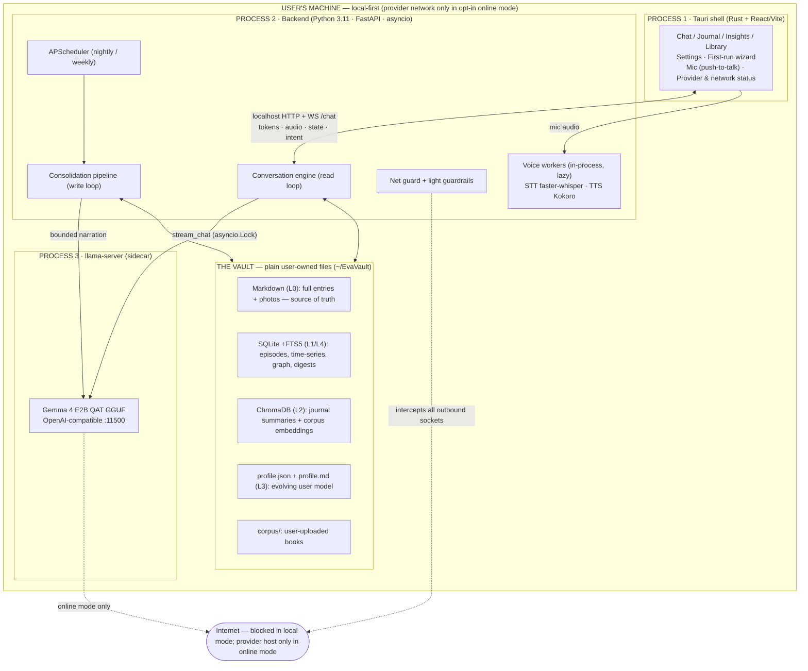
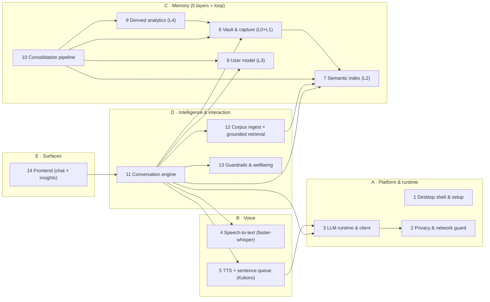
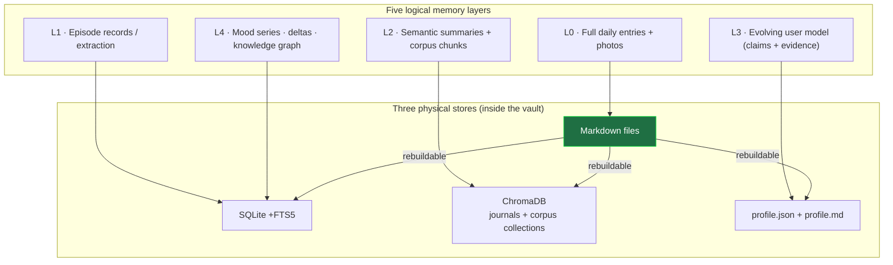
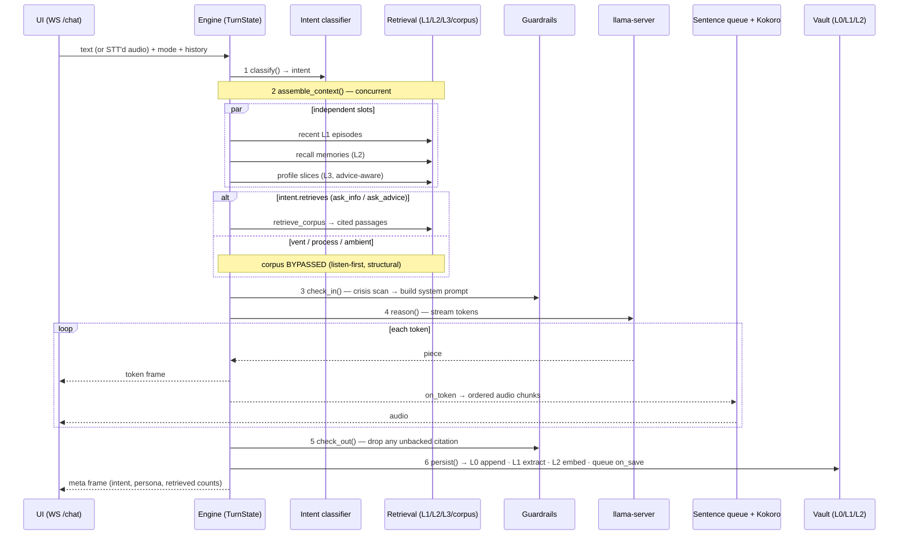
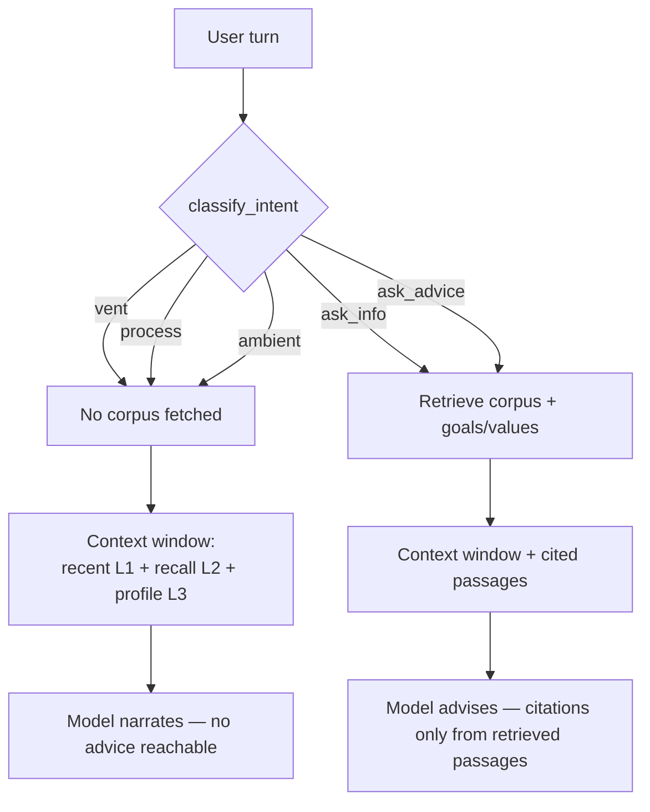
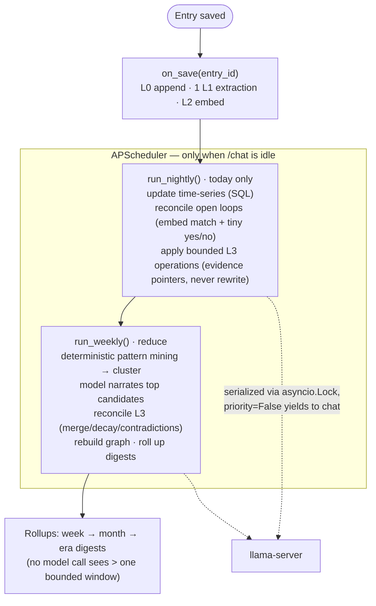
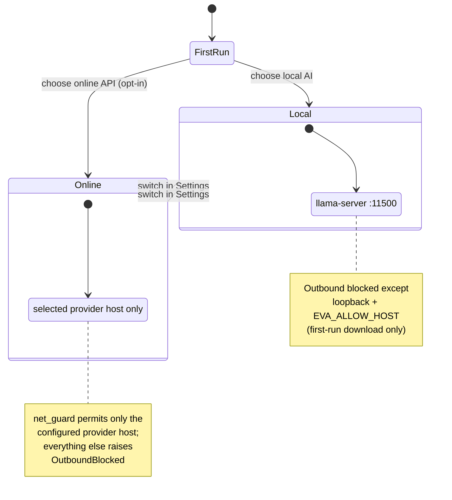
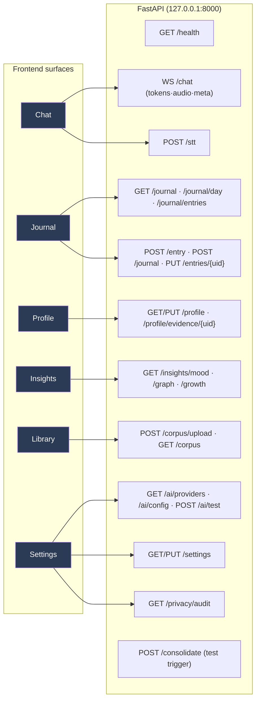
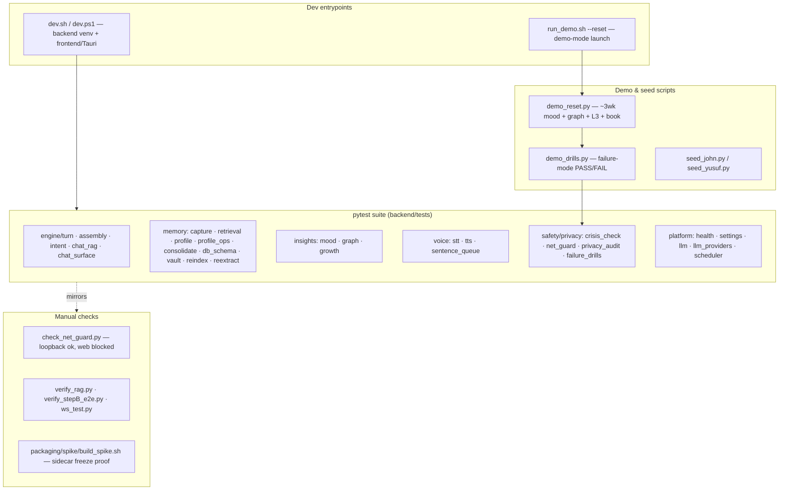

# Eva — System Design & Harness (Mermaid)

Copy-pasteable Mermaid diagrams of Eva's architecture, grounded in the code
(`backend/engine/turn.py`, `backend/app.py` routes, `backend/memory/consolidate.py`,
`backend/llm/providers.py`) and `docs/EVA_SYSTEM_DESIGN.md`.

---

## 1. Process & deployment architecture (3 processes, one machine)

---

## 2. Component architecture (14 components, 5 groups)

---

## 3. Data architecture — 5 memory layers → 3 physical stores

> Rule: every L3 claim carries an evidence pointer to an L1 entry; L1–L4 are all
> rebuildable from L0 (the only irreplaceable store).

---

## 4. Chat turn — the read loop (`engine/turn.py`, 6 steps)

---

## 5. Listen-first intent gate (why the model *can't* over-advise)

---

## 6. Consolidation — the write loop (`memory/consolidate.py`)

---

## 7. Provider mode + network guard (privacy hard law)

---

## 8. Backend API surface (frontend ↔ backend)

---

## 9. Test / dev harness

